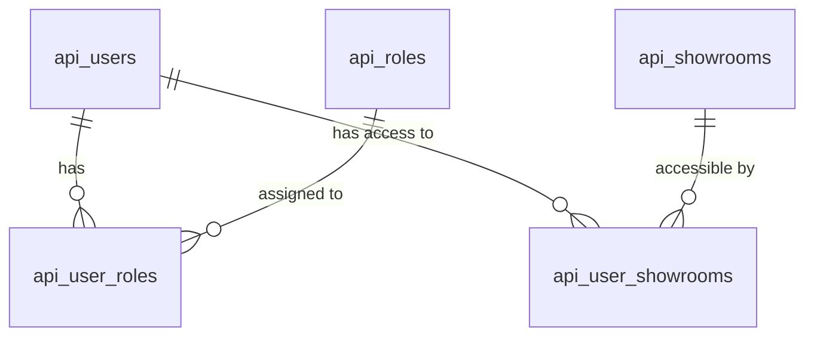
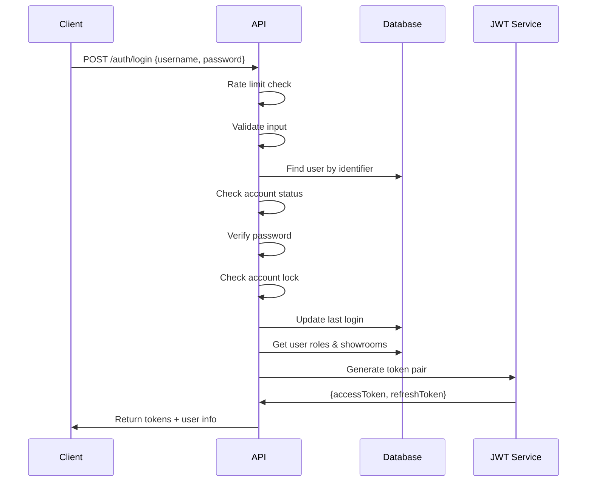
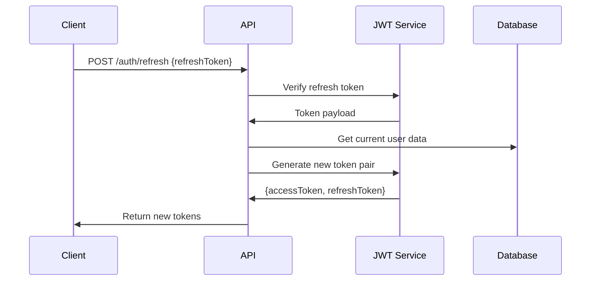

# User Management System Documentation

## Overview

The User Management System provides secure authentication, authorization, and user management capabilities for the Opuzen API. It implements modern security practices including JWT tokens, role-based access control, and comprehensive input validation.

## Table of Contents

1. [Architecture](#architecture)
2. [Database Schema](#database-schema)
3. [Security Features](#security-features)
4. [Authentication Flow](#authentication-flow)
5. [Role System](#role-system)
6. [API Endpoints](#api-endpoints)
7. [Models](#models)
8. [Middleware](#middleware)
9. [Usage Examples](#usage-examples)
10. [Testing](#testing)

---

## Architecture

### Components

- **Models**: UserModel, RoleModel, ShowroomModel
- **Middleware**: Authentication, Authorization, Rate Limiting
- **Controllers**: AuthController, UserController, ShowroomController
- **Utilities**: JWT, Validation, Security
- **Database**: MySQL with proper relationships and indexes

### Security Layers

```
┌─────────────────────────────────────────────────────────────┐
│                    API Layer                                │
├─────────────────────────────────────────────────────────────┤
│  Rate Limiting → Authentication → Authorization → Validation│
├─────────────────────────────────────────────────────────────┤
│                  Business Logic                             │
├─────────────────────────────────────────────────────────────┤
│                  Data Models                                │
├─────────────────────────────────────────────────────────────┤
│                  Database Layer                             │
└─────────────────────────────────────────────────────────────┘
```

---

## Database Schema

### Tables

#### `api_users`
```sql
CREATE TABLE api_users (
    id INT PRIMARY KEY AUTO_INCREMENT,
    username VARCHAR(50) UNIQUE NOT NULL,
    email VARCHAR(255) UNIQUE NOT NULL,
    password_hash VARCHAR(255) NOT NULL,
    first_name VARCHAR(100) NOT NULL,
    last_name VARCHAR(100) NOT NULL,
    phone VARCHAR(20),
    company VARCHAR(255),
    is_active BOOLEAN DEFAULT TRUE,
    email_verified BOOLEAN DEFAULT FALSE,
    email_verification_token VARCHAR(255),
    password_reset_token VARCHAR(255),
    password_reset_expires TIMESTAMP NULL,
    last_login TIMESTAMP NULL,
    failed_login_attempts INT DEFAULT 0,
    locked_until TIMESTAMP NULL,
    created_at TIMESTAMP DEFAULT CURRENT_TIMESTAMP,
    updated_at TIMESTAMP DEFAULT CURRENT_TIMESTAMP ON UPDATE CURRENT_TIMESTAMP
);
```

#### `api_roles`
```sql
CREATE TABLE api_roles (
    id INT PRIMARY KEY AUTO_INCREMENT,
    name VARCHAR(50) UNIQUE NOT NULL,
    description TEXT,
    is_active BOOLEAN DEFAULT TRUE,
    created_at TIMESTAMP DEFAULT CURRENT_TIMESTAMP,
    updated_at TIMESTAMP DEFAULT CURRENT_TIMESTAMP ON UPDATE CURRENT_TIMESTAMP
);
```

#### `api_showrooms`
```sql
CREATE TABLE api_showrooms (
    id INT PRIMARY KEY AUTO_INCREMENT,
    name VARCHAR(255) NOT NULL,
    abbreviation VARCHAR(10) NOT NULL,
    address TEXT,
    city VARCHAR(100),
    state VARCHAR(50),
    zip VARCHAR(20),
    country VARCHAR(100) DEFAULT 'USA',
    phone VARCHAR(20),
    email VARCHAR(255),
    contact_person VARCHAR(255),
    is_active BOOLEAN DEFAULT TRUE,
    created_at TIMESTAMP DEFAULT CURRENT_TIMESTAMP,
    updated_at TIMESTAMP DEFAULT CURRENT_TIMESTAMP ON UPDATE CURRENT_TIMESTAMP
);
```

#### Junction Tables
- `api_user_roles` - Links users to roles
- `api_user_showrooms` - Links users to showrooms

### Relationships



---

## Security Features

### Password Security
- **Bcrypt Hashing**: Salt rounds 12
- **Strength Requirements**: 8+ chars, letters + numbers
- **Secure Reset**: Token-based with 1-hour expiry

### Account Protection
- **Account Locking**: 5 failed attempts = 15-minute lockout
- **Email Verification**: Token-based verification system
- **Active Status**: Deactivated accounts cannot authenticate

### JWT Tokens
- **Access Tokens**: 24-hour expiry
- **Refresh Tokens**: 7-day expiry
- **Token Verification**: Issuer and audience validation
- **Automatic Refresh**: Seamless token renewal

### Input Validation
- **Comprehensive Validation**: All user inputs validated
- **Sanitization**: XSS prevention
- **Type Checking**: Strict data type validation

### Rate Limiting
- **Authentication Endpoints**: 5 attempts per 15 minutes
- **IP-based Limiting**: Prevents brute force attacks

---

## Authentication Flow

### Login Process


### Token Refresh Process


---

## Role System

### Default Roles

| Role | Description | Access Level |
|------|-------------|--------------|
| **admin** | System Administrator | Full access to all features |
| **manager** | Manager | User management, most operations |
| **user** | Regular User | Standard feature access |
| **showroom** | Showroom User | Showroom-specific features |
| **readonly** | Read Only | View access only |

### Role-Based Authorization

```javascript
// Middleware usage examples
router.get('/admin', requireAdmin, handler);
router.get('/manager', requireManager, handler);
router.get('/user/:id', requireSelfOrAdmin('id'), handler);
router.get('/showroom/:id', requireShowroomAccess('id'), handler);
```

### Role Hierarchy
- **Admin**: Can access everything
- **Manager**: Can manage users and standard operations
- **User**: Can access own resources and basic features
- **Showroom**: Can access assigned showroom resources
- **ReadOnly**: Can view assigned resources

---

## API Endpoints

### Authentication Endpoints

#### POST /api/auth/login
**Description**: User login
**Authentication**: None (rate limited)

**Request Body**:
```json
{
  "identifier": "username or email",
  "password": "user_password"
}
```

**Response**:
```json
{
  "success": true,
  "data": {
    "user": {
      "id": 1,
      "username": "john_doe",
      "email": "john@example.com",
      "first_name": "John",
      "last_name": "Doe",
      "roles": ["user"],
      "showrooms": [{"id": 1, "name": "Main Office"}]
    },
    "tokens": {
      "accessToken": "eyJ0eXAiOiJKV1QiLCJhbGciOiJIUzI1NiJ9...",
      "refreshToken": "eyJ0eXAiOiJKV1QiLCJhbGciOiJIUzI1NiJ9...",
      "expiresIn": "24h"
    }
  }
}
```

#### POST /api/auth/refresh
**Description**: Refresh access token
**Authentication**: Refresh token required

**Request Body**:
```json
{
  "refreshToken": "eyJ0eXAiOiJKV1QiLCJhbGciOiJIUzI1NiJ9..."
}
```

#### POST /api/auth/logout
**Description**: User logout
**Authentication**: Required

### User Management Endpoints

#### GET /api/users
**Description**: List all users
**Authentication**: Required (Admin/Manager)

**Query Parameters**:
- `page`: Page number (default: 1)
- `limit`: Items per page (default: 10)
- `role`: Filter by role
- `showroom`: Filter by showroom
- `search`: Search in name/email

#### POST /api/users
**Description**: Create new user
**Authentication**: Required (Admin/Manager)

**Request Body**:
```json
{
  "username": "new_user",
  "email": "user@example.com",
  "password": "secure_password",
  "first_name": "John",
  "last_name": "Doe",
  "phone": "+1234567890",
  "company": "Example Corp",
  "roles": [1, 2],
  "showrooms": [1]
}
```

#### GET /api/users/:id
**Description**: Get user by ID
**Authentication**: Required (Self or Admin)

#### PUT /api/users/:id
**Description**: Update user
**Authentication**: Required (Self or Admin)

#### DELETE /api/users/:id
**Description**: Deactivate user
**Authentication**: Required (Admin)

### Showroom Management Endpoints

#### GET /api/showrooms
**Description**: List all showrooms
**Authentication**: Required

#### POST /api/showrooms
**Description**: Create new showroom
**Authentication**: Required (Admin)

#### GET /api/showrooms/:id
**Description**: Get showroom by ID
**Authentication**: Required

#### PUT /api/showrooms/:id
**Description**: Update showroom
**Authentication**: Required (Admin)

---

## Models

### UserModel

**Key Methods**:
- `createUser(userData)`: Create user with hashed password
- `findByIdentifier(identifier)`: Find by email or username
- `findWithRolesAndShowrooms(id)`: Get user with relationships
- `verifyPassword(password, hash)`: Verify password
- `updatePassword(userId, newPassword)`: Update password
- `assignRole(userId, roleId)`: Assign role to user
- `assignShowroom(userId, showroomId)`: Assign showroom to user
- `hasRole(userId, roleName)`: Check if user has role
- `hasShowroomAccess(userId, showroomId)`: Check showroom access

### RoleModel

**Key Methods**:
- `getAllRoles()`: Get all active roles
- `createRole(roleData)`: Create new role
- `getRoleWithUserCount(roleId)`: Get role with user count
- `getRoleUsers(roleId)`: Get users assigned to role
- `canDeleteRole(roleId)`: Check if role can be deleted

### ShowroomModel

**Key Methods**:
- `getAllShowrooms(filters)`: Get all showrooms with filters
- `createShowroom(showroomData)`: Create new showroom
- `getShowroomWithUserCount(showroomId)`: Get showroom with user count
- `getShowroomUsers(showroomId)`: Get users assigned to showroom
- `searchShowrooms(searchTerm)`: Search showrooms

---

## Middleware

### Authentication Middleware

#### `authenticate`
- Verifies JWT token
- Adds user to request object
- Checks user active status

#### `optionalAuth`
- Optional authentication
- Doesn't fail if no token provided

### Authorization Middleware

#### `requireRole(roles)`
- Requires specific role(s)
- Admin bypasses all role checks

#### `requireShowroomAccess(showroomParam)`
- Requires showroom access
- Admin can access all showrooms

#### `requireSelfOrAdmin(userParam)`
- Users can access own resources
- Admin can access any user

#### `rateLimitAuth(maxAttempts, windowMs)`
- Rate limits authentication attempts
- IP-based limiting

---

## Usage Examples

### Basic Authentication
```javascript
// Login
const response = await fetch('/api/auth/login', {
  method: 'POST',
  headers: { 'Content-Type': 'application/json' },
  body: JSON.stringify({
    identifier: 'john_doe',
    password: 'secure_password'
  })
});

const { data } = await response.json();
const { accessToken } = data.tokens;
```

### Authenticated Requests
```javascript
// Make authenticated request
const response = await fetch('/api/users', {
  headers: {
    'Authorization': `Bearer ${accessToken}`,
    'Content-Type': 'application/json'
  }
});
```

### Role-Based Access
```javascript
// Admin route
router.get('/admin/users', requireAdmin, async (req, res) => {
  const users = await userModel.getAllUsersWithDetails();
  res.json({ success: true, data: users });
});

// Self or admin route
router.get('/users/:id', requireSelfOrAdmin('id'), async (req, res) => {
  const user = await userModel.findByIdSafe(req.params.id);
  res.json({ success: true, data: user });
});
```

---

## Testing

### Unit Tests
```javascript
// Example user model test
describe('UserModel', () => {
  test('should create user with hashed password', async () => {
    const userData = {
      username: 'testuser',
      email: 'test@example.com',
      password: 'testpassword123',
      first_name: 'Test',
      last_name: 'User'
    };
    
    const user = await userModel.createUser(userData);
    expect(user.username).toBe('testuser');
    expect(user.password_hash).toBeUndefined();
  });
});
```

### Integration Tests
```javascript
// Example auth endpoint test
describe('POST /api/auth/login', () => {
  test('should login with valid credentials', async () => {
    const response = await request(app)
      .post('/api/auth/login')
      .send({
        identifier: 'testuser',
        password: 'testpassword123'
      });
    
    expect(response.status).toBe(200);
    expect(response.body.success).toBe(true);
    expect(response.body.data.tokens.accessToken).toBeDefined();
  });
});
```

### Manual Testing with Swagger
- Access Swagger UI at `/api-docs`
- Test authentication endpoints
- Test role-based access
- Test showroom management

---

## Security Best Practices

### Password Security
- Use strong password requirements
- Implement password history (prevent reuse)
- Consider password complexity scoring

### Token Security
- Use short-lived access tokens
- Implement token blacklisting for logout
- Consider rotating refresh tokens

### Account Security
- Implement account lockout policies
- Log security events
- Monitor failed login attempts

### API Security
- Use HTTPS in production
- Implement CORS properly
- Add API rate limiting
- Validate all inputs
- Log security events

---

## Configuration

### Environment Variables
```bash
# JWT Configuration
JWT_SECRET=your-super-secret-key-change-this-in-production
JWT_EXPIRES_IN=24h
JWT_REFRESH_EXPIRES_IN=7d

# Database Configuration
DB_HOST=localhost
DB_PORT=3306
DB_USER=api_user
DB_PASSWORD=secure_password
DB_NAME=opuzen_api
```

### Security Headers
```javascript
// Add to your main app
app.use(helmet({
  contentSecurityPolicy: {
    directives: {
      defaultSrc: ["'self'"],
      styleSrc: ["'self'", "'unsafe-inline'"],
      scriptSrc: ["'self'"]
    }
  }
}));
```

---

## Migration Guide

### Database Migration
```bash
# Run migrations
npm run migrate

# Create new migration
npm run migrate:create create_new_table
```

### Updating from Legacy
1. Export existing user data
2. Run new migrations
3. Import user data with proper hashing
4. Update client applications to use JWT
5. Test all authentication flows

---

## Monitoring and Logging

### Security Events to Log
- Login attempts (success/failure)
- Account lockouts
- Password changes
- Role assignments
- Token refresh events

### Metrics to Monitor
- Authentication success rate
- Failed login attempts
- Account lockout frequency
- Token refresh rate
- API response times

---

## Support and Maintenance

### Regular Tasks
- Review user accounts and roles
- Monitor security logs
- Update dependencies
- Rotate JWT secrets periodically
- Review and update password policies

### Troubleshooting
- Check user account status
- Verify JWT token validity
- Review rate limiting logs
- Check database connections
- Validate environment configuration

---

## Conclusion

This User Management System provides a solid foundation for secure user authentication and authorization. It implements industry-standard security practices while maintaining flexibility for future enhancements.

The system is designed to be:
- **Secure**: Multiple layers of security protection
- **Scalable**: Efficient database queries and caching
- **Maintainable**: Clear separation of concerns
- **Testable**: Comprehensive test coverage
- **Documented**: Extensive documentation and examples

For questions or support, refer to the API documentation or contact the development team. 